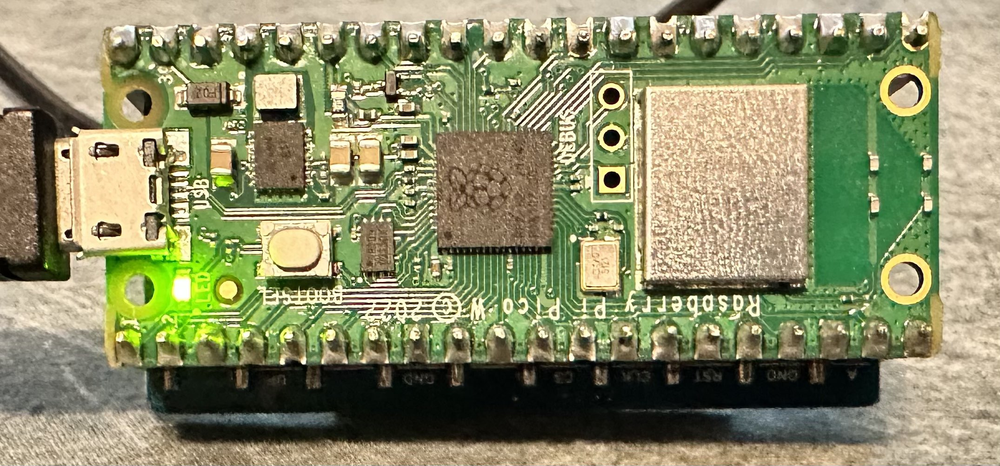
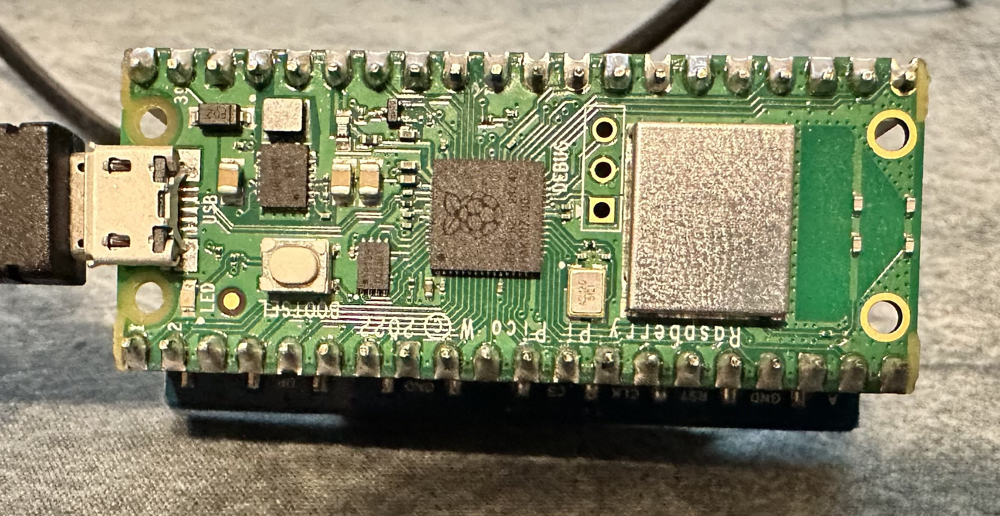

# Getting started
Note: To automatically run your programs on the pico when it boots you must save your python script as main.py
## Install Thonny
[Install Thonny](https://projects.raspberrypi.org/en/projects/getting-started-with-the-pico/2)

## Install Firmware
[install firmware](https://projects.raspberrypi.org/en/projects/getting-started-with-the-pico/3)

## Turn on and off the onboard LED



```python
# Import machine module
from machine import Pin

# set led to value of onboard LED
led = Pin("LED", Pin.OUT)

# Use the below to turn onboard LED on or off
led.value(1)
led.value(0)

# OR use the below code to turn on and off
led.on()
led.off()

# OR use the below to toggle on/off
led.toggle()
```
